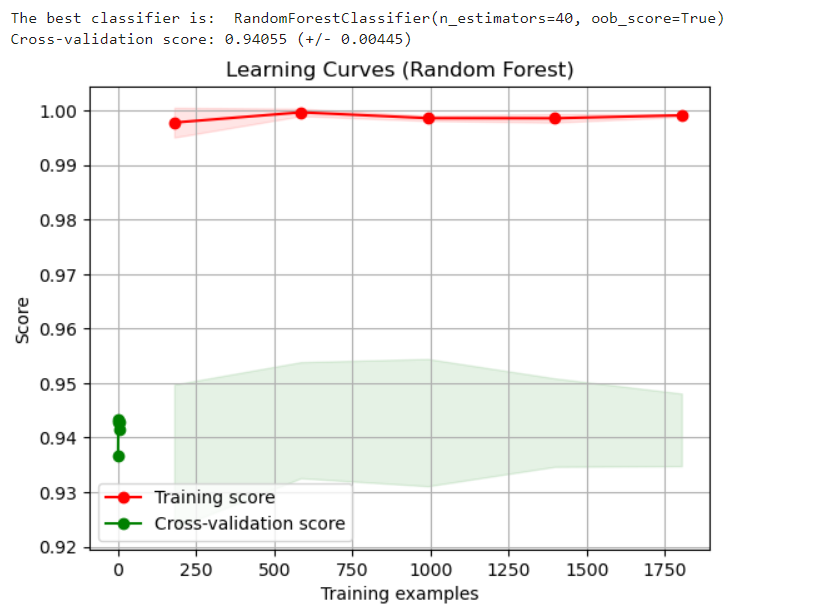

# Social Media Fake Account Detection

## Problem Statement
The rise of fake social media accounts has become a major issue for online platforms, leading to the spread of misinformation, fraudulent activities, and disruption of authentic user interactions. To address this, we aim to build a robust system that accurately detects fake accounts using advanced machine learning models. Our solution focuses on Random Forest, SVM, and CNN models to classify social media accounts as fake or genuine, addressing the limitations of existing approaches.

## Team Members
- Aalya Jain
- Abhay Das
- Adarsh Mishra
- Aryan Sarthak
- Madhav Singh
- Shivam Krishna

## Category
Software

## Project ID
SIH1775

## Solution Overview
We propose a web-based platform that allows users to input the details of a social media account (like followers count, statuses, etc.). This data is processed by the backend machine learning models, which then classify the account as fake or genuine. The platform utilizes several algorithms—Random Forest, Support Vector Machine (SVM), and Convolutional Neural Networks (CNN)—to provide accurate predictions.

## Machine Learning Algorithms

### Random Forest Classifier
- **Description:** Random Forest is an ensemble learning method based on decision trees. It builds multiple trees and merges them to get a more accurate and stable prediction. By randomly selecting features for each tree, Random Forest reduces overfitting and increases generalization.
- **Advantages:** Handles missing data and noisy features well. Provides feature importance, which helps in understanding the significance of various account attributes like followers, statuses, etc.
- **Challenges Solved:** Traditional decision trees tend to overfit the data, especially when working with unbalanced datasets. Random Forest addresses this by aggregating the results of multiple trees.

**Images:**
1. 
2. 
3. 

### Support Vector Machine (SVM)
- **Description:** SVM is a supervised learning model used for binary classification. It works by finding the hyperplane that best separates the data points of two different classes (fake and genuine accounts) in high-dimensional space. The use of kernels allows SVM to handle non-linearly separable data.
- **Advantages:** SVM is highly effective in high-dimensional spaces and is robust against overfitting, particularly in cases where the number of features is larger than the number of data points.
- **Challenges Solved:** Existing fake account detection methods may struggle with small, high-dimensional datasets. SVM improves performance by finding an optimal boundary between classes, even when the data isn't linearly separable.

**Images:**
1. 
2. 
3. 

### Convolutional Neural Network (CNN)
- **Description:** CNN is a deep learning model commonly used for image processing, but its ability to extract hierarchical features makes it suitable for structured data as well. In our system, CNN is used to detect intricate patterns in account features that may not be obvious, such as the correlation between statuses count, followers, and friends count.
- **Advantages:** CNN automatically learns feature representations through its convolution layers, reducing the need for manual feature extraction.
- **Challenges Solved:** While Random Forest and SVM rely on pre-engineered features, CNN can automatically detect complex patterns, making it more powerful for intricate classification problems.

**Images:**
1. 
2. 

## Stages of Development

### Data Collection and Preprocessing
- **Dataset Sources:** Genuine and fake user profiles collected from publicly available data.
- **Feature Extraction:** Features such as followers count, statuses count, and friends count are used. We perform feature engineering by converting categorical attributes (e.g., language) into numerical codes.
- **Data Standardization:** The features are standardized to ensure consistent scales, improving model convergence.

### Model Training
- **Random Forest:** Trained with multiple decision trees to improve robustness and reduce overfitting. Cross-validation is used to ensure the model generalizes well.
- **SVM:** Optimized using GridSearchCV to find the best hyperparameters (kernel type, regularization, etc.). SVM is used for its high performance in high-dimensional datasets.
- **CNN:** Constructed using Conv1D layers to detect patterns in the input data. Dropout layers are added to prevent overfitting, and the model is trained over multiple epochs.

### Performance Evaluation
- **Accuracy:** The overall accuracy is computed by comparing predictions against actual labels.
- **Confusion Matrix:** Provides a detailed breakdown of the number of true positives, false positives, true negatives, and false negatives.
- **ROC Curve:** Visualizes the tradeoff between true positive and false positive rates across different classification thresholds, with the area under the curve (AUC) indicating model performance.

### Web Interface
- **User Input:** Users enter social media account details into a web form.
- **Backend Processing:** The entered data is passed to the trained ML models, which return a prediction of whether the account is fake or genuine.
- **Result Display:** The platform outputs the prediction along with relevant performance metrics like the model's confidence score.

## What’s New in Our Approach
- **Ensemble of Algorithms:** Unlike existing solutions that often rely on a single classifier, our approach leverages an ensemble of Random Forest, SVM, and CNN models. This allows us to harness the strengths of each algorithm and improve overall accuracy.
- **Pattern Detection with CNN:** While traditional models focus on manually engineered features, our use of CNN allows the system to automatically learn complex relationships between features, leading to more accurate predictions of fake accounts.
- **Comprehensive Evaluation Metrics:** Beyond simple accuracy, we employ advanced evaluation techniques like confusion matrices, ROC curves, and cross-validation to ensure that our models perform well under different conditions.
- **Real-Time User Interaction:** The integration of a web platform with real-time backend processing offers users immediate feedback on whether an account is fake or genuine. This user-centric design is more efficient compared to existing manual detection methods, which are often slow and inaccurate.

## Problems with Existing Methods and Our Solution
- **Overfitting and Bias:**
  - **Problem:** Many existing models overfit to the training data, especially when working with small datasets or unbalanced classes.
  - **Solution:** By using Random Forest and SVM, we mitigate overfitting through cross-validation and hyperparameter tuning, ensuring that the models generalize well to new data.
  
- **Limited Feature Exploration:**
  - **Problem:** Previous systems rely heavily on manually selected features, which may not capture subtle indicators of fake accounts.
  - **Solution:** Our CNN model automatically extracts complex patterns and correlations between account attributes, improving classification accuracy without extensive manual intervention.

- **Slow and Inaccurate Detection:**
  - **Problem:** Many detection systems are slow due to manual intervention or lack real-time feedback, and they often produce inaccurate results.
  - **Solution:** Our platform provides real-time predictions with a high degree of accuracy, giving users immediate feedback on their input.
  
# Content Sentiment Analysis

## Project Overview

This part aims to analyze the sentiment of their posts using advanced machine learning models. The system integrates multiple datasets and machine learning algorithms, including Random Forest, SVM, and CNN, to classify accounts and assess sentiment.

## Features
- **Web Scraping**: Scrapes social media account data from user-provided URLs.
- **Machine Learning Models**: Utilizes Random Forest, SVM, and CNN for fake account detection.
- **Sentiment Analysis**: Analyzes the sentiment of posts to determine if they are positive, negative, or neutral.
- **Real-Time Predictions**: Provides immediate feedback on the authenticity of accounts and sentiment of posts.

## Datasets

### 1. Sentiment140
- **Description**: Contains 1.6 million labeled tweets annotated with sentiment (positive, negative, neutral).
- **Usage**: Used to train sentiment analysis models.
- **Accuracy**: Models trained on this dataset typically achieve high accuracy in sentiment classification due to the large and diverse set of tweets.

### 2. Twitter US Airline Sentiment
- **Description**: Contains tweets about US airlines with sentiment labels (positive, negative, neutral).
- **Usage**: Used to refine sentiment analysis specific to the airline industry and gauge sentiment in customer feedback.
- **Accuracy**: Generally high, as it focuses on a well-defined domain with a clear sentiment label distribution.

### 3. Hate Speech and Offensive Language
- **Description**: Includes tweets labeled as hate speech, offensive language, or neither.
- **Usage**: Employed to detect and analyze harmful language, enhancing the model's ability to classify malicious content.
- **Accuracy**: Varies based on the dataset and model, but well-tuned models can achieve high accuracy in identifying hate speech and offensive language.

### 4. LIAR Dataset
- **Description**: Consists of six CSV files with data related to factual claims, including labels for claim veracity and stance.
- **Files**:
  - `competition_test_bodies.csv`
  - `competition_test_stances.csv`
  - `unlabeled_test_bodies.csv`
  - `test_stances_unlabeled.csv`
  - `train_bodies.csv`
  - `train_stances.csv`
- **Usage**: Used for fact-checking and stance detection in political statements.
- **Accuracy**: Models trained on this dataset focus on the accuracy of claims and stances, often achieving high precision in stance classification.

## Tech Stack

### Frontend:
- HTML/CSS/JavaScript for user interface.
- React.js or Vue.js for dynamic, responsive UI.

### Backend:
- **Python (Flask/Django)**: Handles user requests and processes data.
- **Web Scraping**:
  - BeautifulSoup for scraping social media data.
  - Selenium for dynamic content scraping.
- **ML Libraries**:
  - Pandas/Numpy for data processing.
  - Scikit-learn for Random Forest and SVM.
  - TensorFlow/Keras for CNN model.
  - NLTK/Transformers for sentiment analysis.

### Database:
- MongoDB/MySQL for storing user data, scraped features, and predictions.

### Machine Learning Models:
- **Random Forest**: For basic classification tasks.
- **SVM**: For handling high-dimensional data.
- **CNN**: For detecting complex patterns in user data.
- **Sentiment Analysis**: Using models trained on Sentiment140, Twitter US Airline Sentiment, and Hate Speech datasets.

### Deployment:
- Docker for containerization.
- AWS EC2/Heroku for hosting.
- AWS S3/Google Cloud Storage for storing models and datasets.

## How it Works

1. **User Input**: 
   - The user inputs the URL of a social media account through the web interface.
   
2. **Web Scraping**: 
   - The backend scrapes data from the social media profile (e.g., followers count, statuses, etc.).
   
3. **Data Preprocessing**: 
   - The scraped data is cleaned and prepared for model input using Pandas and Numpy.

4. **Sentiment Analysis**:
   - The text data from posts is analyzed using sentiment analysis models trained on Sentiment140, Twitter US Airline Sentiment, and Hate Speech datasets. Sentiment (positive, negative, neutral) is determined.

5. **Machine Learning Models**: 
   - The preprocessed data and sentiment analysis results are fed into Random Forest, SVM, and CNN models. The models classify the account as fake or genuine.

6. **Output**: 
   - The prediction (fake or genuine) and sentiment analysis results are displayed to the user with additional model confidence metrics.

## Performance Metrics

- **Accuracy**: The models achieve high accuracy based on cross-validation and test set evaluations.
- **Confusion Matrix**: Provides a detailed breakdown of true positives, false positives, true negatives, and false negatives.
- **ROC Curve**: Visualizes the tradeoff between true positive and false positive rates, with the area under the curve (AUC) indicating model performance.

## What’s New in Our Approach
- **Sentiment Analysis Integration**: The system now includes sentiment analysis to evaluate the nature of posts.
- **Ensemble of Algorithms**: Combines Random Forest, SVM, and CNN for robust fake account detection.
- **Pattern Detection with CNN**: Automatically learns complex patterns in user data.
- **Comprehensive Evaluation Metrics**: Utilizes confusion matrices, ROC curves, and cross-validation.
- **Real-Time User Interaction**: Provides immediate feedback on account authenticity and sentiment.

## Problems with Existing Methods and Our Solution
- **Overfitting and Bias:**
  - **Problem:** Existing models often overfit the training data.
  - **Solution:** Random Forest and SVM mitigate overfitting through cross-validation and hyperparameter tuning.

- **Limited Feature Exploration:**
  - **Problem:** Previous systems rely on manually selected features.
  - **Solution:** CNN automatically extracts complex patterns, improving accuracy.

- **Slow and Inaccurate Detection:**
  - **Problem:** Existing systems may be slow and inaccurate.
  - **Solution:** Provides real-time predictions with high accuracy.

## Installation
To run this project, make sure you have the required libraries installed:

```bash
pip install numpy pandas matplotlib scikit-learn tensorflow nltk transformers

## Conclusion
Our project offers an innovative solution to the problem of fake social media account detection by combining multiple machine learning models. The integration of Random Forest, SVM, and CNN allows for a more accurate and robust classification system, addressing the limitations of current methods. With real-time interaction through the web platform, users can easily identify fake accounts and take appropriate action, contributing to a safer and more trustworthy online environment.

## Installation
To run this project, make sure you have the required libraries installed:

```bash
pip install numpy pandas matplotlib scikit-learn tensorflow
